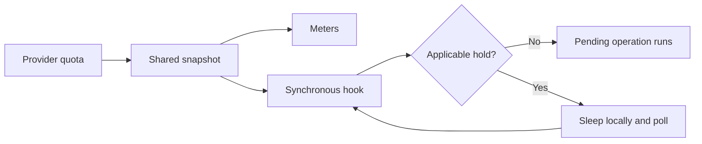

# Usage auto-pause for Claude Code and Codex

[](LICENSE)
[](https://www.python.org)
[](claude/README.md)
[](codex/README.md)

Spread subscription usage across the week, see how far ahead of pace you are,
and automatically wait at tool boundaries when you burn too quickly.

This example repo collects the actual Claude and Codex pacing implementations,
shared quota readers, terminal batteries, browser instruments, and native macOS
meters. Hooks sleep locally; quota polling makes no model requests.

## Try it without an account

```sh
python3 scripts/demo.py
python3 meters/widget.py --demo
# Open http://127.0.0.1:8765; Ctrl-C stops the server.
python3 scripts/check.py
```

The command-line demo replays the real rule engines against synthetic readings.
The browser demo displays synthetic meters. Neither reads credentials, queries
providers, changes installed hooks, or waits for real quota resets.

## What “ahead of pace” means

For a quota window of `duration_hours`, the ideal allowance used increases
linearly from 0% at the window's start to 100% at its reset:

```text
ideal_percent = 100 × elapsed_time / window_duration
lead_hours    = (used_percent − ideal_percent) × duration_hours / 100
```

Halfway through a 168-hour week, 50% is on pace. Using 55% puts you **8.4 hours
ahead**. With no further spending, waiting 4.4 hours brings that lead down to
+4 hours. Other sessions spending the same allowance push the resume time out.
This is a flat weekly budget, not a prediction of your future work schedule.



## Pause rules

| Rule | Behavior |
|---|---|
| An applicable allowance is **over 98%** used | Wait for headroom or its reset; exactly 98% does not trigger this rule |
| Fresh weekly lead reaches **+8 hours** | Establish a shared hold |
| Fresh lead remains between **+4 and +8 hours** | Keep an existing hold; do not start a new one |
| Fresh lead reaches **+4 hours or less** | Release the weekly hold |
| Multiple applicable holds | The longest hold wins |

The +8/+4 gap is hysteresis: it avoids rapid stop/start cycles near the trigger.
These are the default rules. Claude also supports session-specific thresholds.

**The failure policies differ in the captured implementation:** Codex retains an
established weekly hold through stale or missing readings until fresh weekly data
confirms release. Claude retains a stale weekly hold only while the last-known
reading still projects at or above the trigger, with the same reset timestamp;
it may let a call proceed sooner. Both retain a last-known >98% hard hold until
that reading's reset. See [the research notes](docs/research.md) for exact cases.

## Choose an integration

| Component | What it does | Guide |
|---|---|---|
| Claude hook + statusline | Gates `PreToolUse`; shows context, session usage, weekly pace | [Claude setup](claude/README.md) |
| Codex hooks | Gates `UserPromptSubmit` and `PreToolUse` | [Codex setup](codex/README.md) |
| Terminal `status` / `watch` | Shows both providers, model allowances, and hold estimates | [Meters](meters/README.md) |
| Browser / native macOS meters | Visual instruments; never pause work | [Meters](meters/README.md) |

Python 3.9+ is required for the scripts (validated here on Python 3.11). Codex's
reader/gate uses Unix locks and targets macOS/Linux. Claude's credential reader
uses the macOS Keychain, so its live integration targets macOS. Only the native
app needs third-party Python packages. Keep this checkout intact: the components
import one another through relative paths.

## What is and isn't paused

A synchronous hook holds its pending operation, then exits successfully so that
operation continues. Every session that reaches a configured hook checks the
shared quota state. It does not freeze already-running shell jobs, an in-flight
model response, remote clients, or calls that don't pass through these hooks.
Claude has no prompt gate here, so the initial response can consume usage before
its first tool call. Pacing is assistance, not a hard spending or billing cap.

Claude selects allowances using the calling agent's transcript model, including
subagents, and rechecks that model while waiting. Codex uses the model in its
hook payload. Account-wide and model-specific quota windows are distinct; a
missing general session window is never replaced with a different model's quota.

The **graphical PACE HOLD label is a threshold warning**, not proof that a process
is paused. It does not read persisted holds or overrides. The terminal and Claude
statusline expose more hold detail; the statusline also maintains Claude's latch.

## Help and implementation notes

- [Setup, overrides, uninstall: Claude](claude/README.md) / [Codex](codex/README.md)
- [Meter commands and native build](meters/README.md)
- [Troubleshooting](docs/troubleshooting.md)
- [Research, source trace, and behavior differences](docs/research.md)
- [Configuration and state files](docs/configuration.md)
- [Verification and portable packaging changes](docs/verification.md)
- [Bundled implementation hashes](docs/source-manifest.json)

This is a source snapshot prepared on 2026-10-02. No credentials, account usage,
transcripts, personal hold files, or installed trust hashes are included. The
Claude reader uses an OAuth usage endpoint and local credential format that may
change; the Codex reader uses its app-server rate-limit RPC. Review compatibility
with your installed clients before enabling gates. [MIT](LICENSE).
