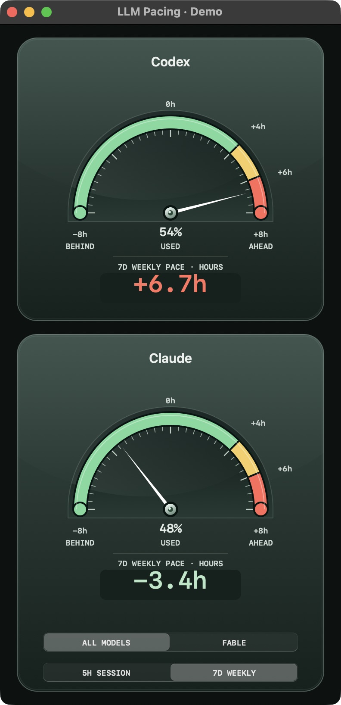

# Pacing meters

## Meter preview

Actual native app capture with synthetic readings; no account data is shown.



See the [design and contrast checks](../docs/meter-design.md).

## Terminal

From the repository root:

```sh
python3 scripts/demo_meter.py  # Synthetic console output, no account access
python3 codex/pace.py status
python3 codex/pace.py watch
python3 codex/pace.py status --bucket claude --claude-model opus
python3 codex/pace.py status --bucket claude --claude-model fable
```

The terminal shows raw usage, ideal percentage, signed hours ahead/behind, and
hold estimates. It follows the most recently active main Claude session unless
`--claude-model` is supplied. That flag changes display selection only. No known
session is explicitly labeled; it does not guess a model. The Claude terminal
view uses the default threshold-pair hold file, so a session with custom pacing
thresholds may differ. Use that session's statusline for its own rules.

`watch` redraws every five seconds. Terminal/native quota refreshes reuse readings
for five minutes, while gates request 60-second freshness. Cache access can write
quota files even though meters never run a pause gate.

## Browser

```sh
python3 meters/widget.py --demo       # Synthetic data, no credentials/network
python3 meters/widget.py              # Live providers, bind 127.0.0.1:8765
python3 meters/widget.py --port 8766   # Alternate local port
python3 meters/widget.py --demo --once
```

Open the printed localhost URL. The needle uses a fixed −8h to +8h scale; the
numeric reading keeps values outside that range. Browser buttons choose the
Claude five-hour or weekly display. Its weekly meter follows the active model.
The browser polls the local server every five seconds, but its backend throttles
provider refreshes to 60 seconds. This differs from the native app's five-minute
refresh. Stop with Ctrl-C. No remote listener or background service is installed.

## Native macOS app

```sh
cd meters
python3 -m venv .venv
.venv/bin/python -m pip install -r requirements-native.txt
.venv/bin/python native_app.py --demo  # Synthetic readings, no account access
.venv/bin/python native_app.py         # Live providers
# Optional app bundle:
.venv/bin/python setup.py py2app
```

The build uses the sibling `codex` modules and copies the Claude helper into app
resources, so it does not depend on the original developer's hook directory.
Generated `claude_pace.py`, `build/`, and `dist/` are ignored by Git. The resulting
bundle is `meters/dist/LLM Pacing.app`. The Codex CLI must still be installed on
the launch PATH; the app adds common macOS installation directories. Claude still
needs a valid login in the current user's Keychain. Build dependencies are pinned
to the original app's versions; packaging may need adjustment on other Python or
macOS releases.

The native app offers **All Models / Fable** and **5H Session / 7D Weekly** display
selectors and remembers them. The shared five-hour quota is the same under both
allowances. These controls do not change the running agent's model. Native
refresh is every five minutes, with a five-second redraw and refresh on wake.
Cmd-R requests a refresh but respects shared-cache throttling.

## Reading the warning labels

`STALE` means a refresh failed or a reading is too old for that view. Missing or
expired windows are unavailable. Negative lead does not guarantee headroom:
a >98% allowance can still trigger a hard hold.

The native `PACE HOLD` summary is computed from current percentage/lead thresholds.
It does not read the durable latch or override state, so a gate can still be
latched at +6h while the graphical meter shows no hold warning. The browser
instruments likewise are not a gate-state monitor. The terminal's textual pause
summary does consult saved holds. Its colored individual bars are instantaneous
threshold indicators, so color alone is not an authoritative hold verdict.

## Manual demo states

In native `--demo` mode, the Demo menu provides normal, loading, unavailable,
expired, stale, weekly hold, hard cutoff, behind pace, and on-pace states
(Cmd-1 through Cmd-9). Cmd-minus selects the minimum size, Cmd-equals restores
the default, and Cmd-0 selects a wide window. Try both allowance and period
selectors. Demo mode does not read account data or save display preferences.
